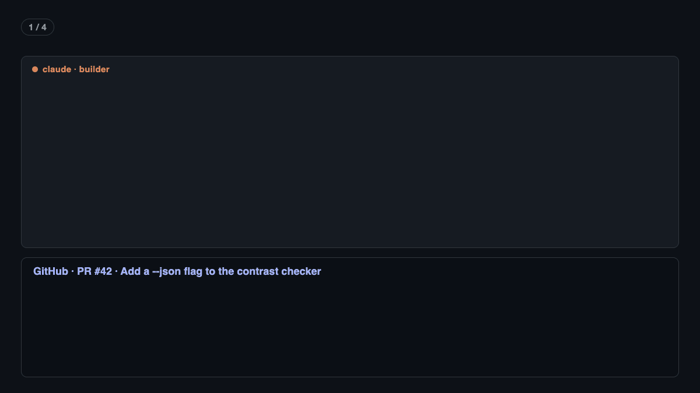

# PR review handoff: two coding agents review each other's PRs

When Claude Code or Codex opens a pull request, the other one reviews it. The builder then fixes
the findings and replies on the PR. You type the task; a small hook does the rest.



It runs inside [Herdr](https://herdr.dev), a terminal workspace for coding agents. Herdr lets one
agent start, prompt and read another agent in the next pane.

## What happens

1. The builder (Claude Code or Codex) runs `gh pr create`.
2. A `PostToolUse` hook sees it and finds the new PR.
3. The hook splits the builder's pane and starts the other tool there, labelled `codex review` or
   `claude review`. The next PR from the same workspace and repository reuses that pane.
4. The reviewer reads the PR and posts its findings as one review comment, ranked P0 to P3.
5. When the builder is free, the hook asks it to fix the findings, push, and reply on the PR. The
   reply lists each finding as "fixed in `<commit>`" or "not fixed", with the reason.

Claude's PRs go to Codex, and Codex's PRs go to Claude. Set `PR_REVIEWER=claude` or
`PR_REVIEWER=codex` before you start an agent to choose the reviewer yourself.

## What you need

- [Herdr](https://herdr.dev), with your agents running in Herdr panes.
- [Claude Code](https://claude.com/claude-code), [Codex](https://github.com/openai/codex), or both.
  With only one of them, set `PR_REVIEWER` to that one.
- [GitHub CLI](https://cli.github.com) (`gh`), logged in.
- Node.js 18 or newer. `python3` for the installer.

## Install

```bash
./scripts/hooks/pr-review-handoff/install.sh
```

The installer:

- copies the hook to `~/.agents/hooks/pr-review-handoff/`;
- adds one `PostToolUse` entry to `~/.claude/settings.json` and to `~/.codex/hooks.json`, and
  creates either file if it is missing. Your other settings stay as they are. A second run
  updates the entry; it never adds a second one.

Then:

- Start new Claude Code and Codex sessions, so they load the hook.
- Codex asks you once to approve the new hook. Approve it in Codex.
- The first time an agent starts in a new folder, it may ask whether you trust the folder.
  Herdr shows a notification when an agent waits for you.

## What it does and does not do

- It posts the review and the reply on GitHub **without asking you first**. It never approves,
  merges or closes a PR. You still decide what ships.
- It only prompts panes it opened itself, plus the builder pane that ran `gh pr create`. Your
  other panes are never touched.
- The reviewer starts with an empty context each time (`/clear` or `/new`), so it sees only the
  PR, not the builder's work. The builder keeps its context, because it needs it to fix its work.
- It waits until an agent is idle before it sends a prompt, so it never interrupts work.
- It does nothing outside Herdr, and nothing for any command except `gh pr create`.
- The hook itself returns at once. The work runs in a separate process, so the builder never waits.

## When something goes wrong

- See what the hook did: `tail ~/.local/state/pr-review-handoff/log`.
- "No review posted": the reviewer stopped without a new comment on the PR. A dialog may have
  caught the prompt. Look at the reviewer pane.
- No reviewer pane opens: start a new agent session, so that it loads the hook, and check that
  Codex approved the hook.

## Remove it

Delete the entries that mention `pr-review-handoff/hook.mjs` from `~/.claude/settings.json` and
`~/.codex/hooks.json`, then delete `~/.agents/hooks/pr-review-handoff/`.

## Tests

```bash
node --test scripts/hooks/pr-review-handoff/hook.test.mjs
```
